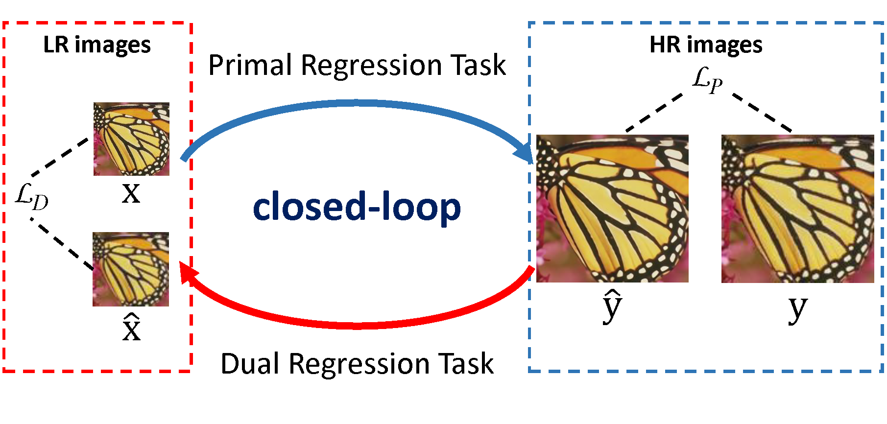

# Closed-loop Matters: Dual Regression Networks for Single Image Super-Resolution [[arXiv]](https://arxiv.org/pdf/2003.07018.pdf)

Pytorch implementation for "Closed-loop Matters: Dual Regression Networks for Single Image Super-Resolution".

<p align="center">

</p>


## Dependencies
```
Python>=3.7, PyTorch>=1.1, numpy, skimage, imageio, matplotlib, tqdm
```


## Quickstart (Model Testing)

Results of our [pretrained models](https://github.com/guoyongcs/DRN/releases):

| Model | Scale | #Params (M) | PSNR on Set5 (dB) |
| :---: | :---: | :---------: | :---------------: |
| DRN-S |   4   |     4.8     |       32.68       |
|       |   8   |     5.4     |       27.41       |
| DRN-L |   4   |     9.8     |       32.74       |
|       |   8   |    10.0     |       27.43       |

You can evaluate our models on several widely used [benchmark datasets](https://cv.snu.ac.kr/research/EDSR/benchmark.tar), including Set5, Set14, B100, Urban100, Manga109. Note that using an old PyTorch version (earlier than 1.1) would yield wrong results.

```bash
python main.py --data_dir $DATA_DIR$ \
--save $SAVE_DIR$ --data_test $DATA_TEST$ \
--scale $SCALE$ --model $MODEL$ \
--pre_train $PRETRAINED_MODEL$ \
--test_only --save_results
```

- DATA_DIR: path to save data
- SAVE_DIR: path to save experiment results
- DATA_TEST: the data to be tested, such as Set5, Set14, B100, Urban100, and Manga109
- SCALE: super resolution scale, such as 4 and 8
- MODEL: model type, such as DRN-S and DRN-L
- PRETRAINED_MODEL: path of the pretrained model


For example, you can use the following command to test our DRN-S model for 4x SR.

```bash
python main.py --data_dir ~/srdata \
--save ../experiments --data_test Set5 \
--scale 4 --model DRN-S \
--pre_train ../pretrained_models/DRNS4x.pt \
--test_only --save_results
```

If you want to load the pretrained dual model, you can add the following option into the command.

```
--pre_train_dual ../pretrained_models/DRNS4x_dual_model.pt
```


## Training Method

We use DF2K dataset (the combination of [DIV2K](https://data.vision.ee.ethz.ch/cvl/DIV2K/) and [Flickr2K](http://cv.snu.ac.kr/research/EDSR/Flickr2K.tar) datasets) to train DRN-S and DRN-L.

```bash
python main.py --data_dir $DATA_DIR$ \
--scale $SCALE$ --model $MODEL$ \
--save $SAVE_DIR$
```

- DATA_DIR: path to save data
- SCALE: super resolution scale, such as 4 and 8
- MODEL: model type, such as DRN-S and DRN-L
- SAVE_DIR: path to save experiment results


For example, you can use the following command to train the DRN-S model for 4x SR.

```bash
python main.py --data_dir ~/srdata \
--scale 4 --model DRN-S \
--save ../experiments 
```


## Citation

If you use any part of this code in your research, please cite our paper:

```
@inproceedings{guo2020closed,
  title={Closed-loop Matters: Dual Regression Networks for Single Image Super-Resolution},
  author={Guo, Yong and Chen, Jian and Wang, Jingdong and Chen, Qi and Cao, Jiezhang and Deng, Zeshuai and Xu, Yanwu and Tan, Mingkui},
  booktitle={Proceedings of the IEEE Conference on Computer Vision and Pattern Recognition},
  year={2020}
}
```
